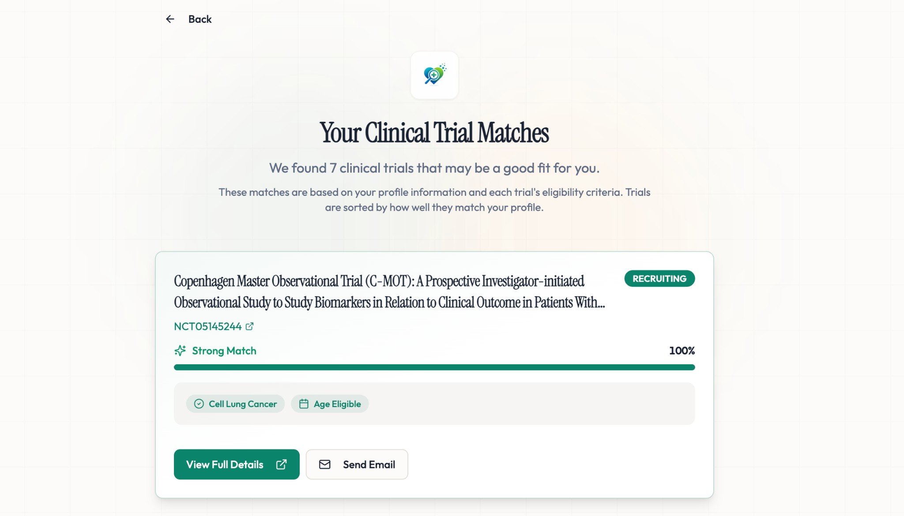
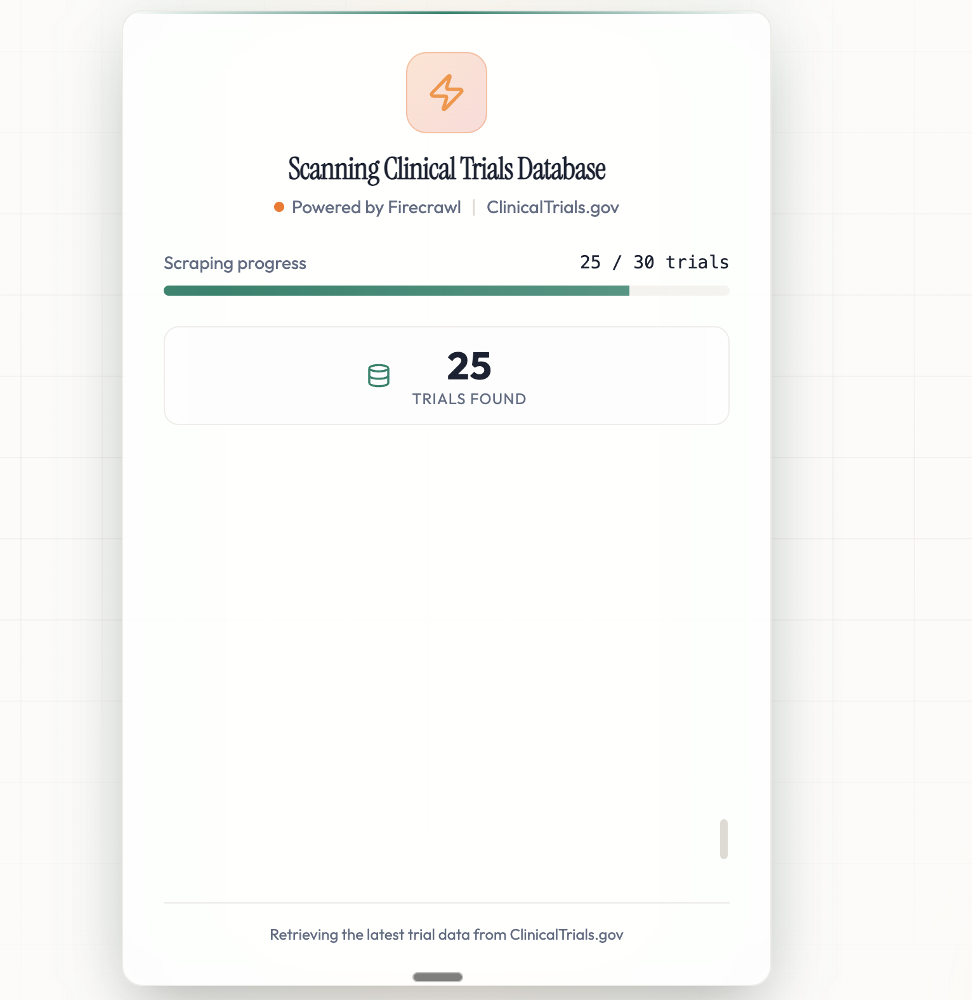
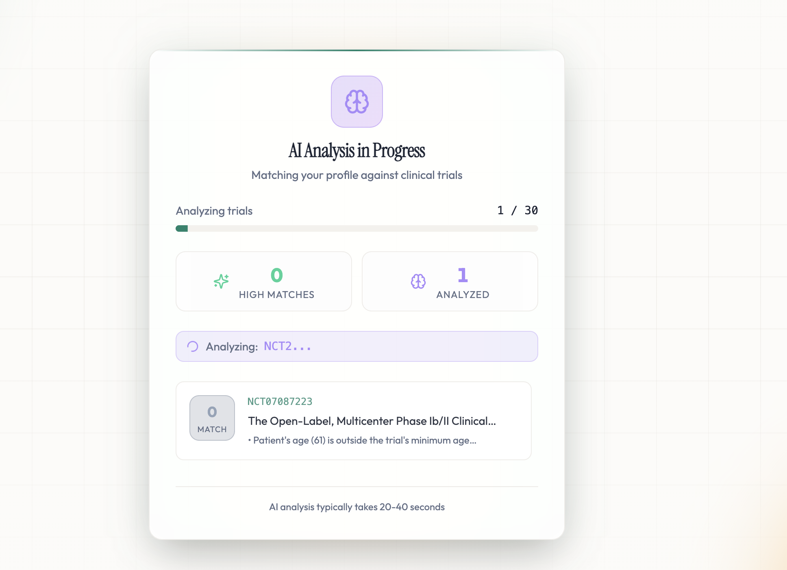
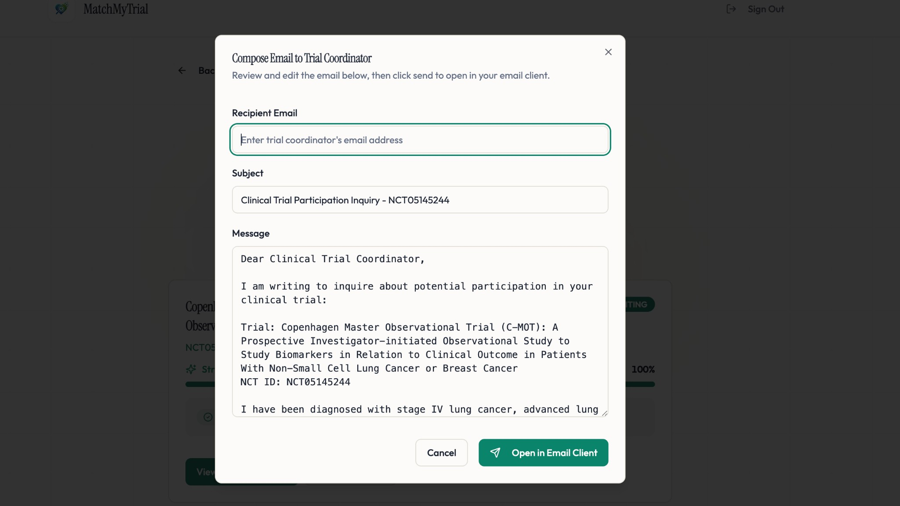

# MatchMyTrial

**AI-powered clinical trial matching platform** that connects patients with relevant clinical trials based on their medical profile. Built with privacy-first principles and real-time data from ClinicalTrials.gov.



## Overview

MatchMyTrial helps patients discover clinical trials that match their medical conditions, demographics, and health status. The platform uses AI to analyze eligibility criteria and provides personalized match scores, making it easier for patients to find relevant research opportunities.

## Features

### 🔍 Smart Trial Discovery

The platform scrapes ClinicalTrials.gov in real-time using Firecrawl, ensuring you always see the latest available trials.



### 🤖 AI-Powered Matching

Advanced AI analysis matches your profile against clinical trials, providing detailed reasoning for each match score.



### 📊 Personalized Results

View your matches sorted by relevance, with clear indicators showing match strength and eligibility criteria.


### 📧 Easy Communication

Pre-filled email templates make it simple to contact trial coordinators with your inquiry.



## Tech Stack

### Frontend (`webapp/`)
- **React 18** with Vite
- **TypeScript** for type safety
- **Tailwind CSS** + **shadcn/ui** for UI components
- **React Router v6** for routing
- **React Query** for server state management
- **Framer Motion** for animations
- **Better Auth** for authentication

### Backend (`backend/`)
- **Bun** runtime
- **Hono** web framework
- **Zod** for schema validation
- **MongoDB** for data persistence
- **OpenAI API** for AI-powered matching
- **Firecrawl** for web scraping ClinicalTrials.gov
- **Reducto** for document extraction
- **Resend** for email services

## Getting Started

### Prerequisites

- [Bun](https://bun.sh) (v1.0+)
- MongoDB Atlas account (or local MongoDB instance)
- API keys for:
  - OpenAI
  - Firecrawl
  - Reducto (optional, for document uploads)
  - Resend (for email OTP)

### Installation

1. **Clone the repository**
   ```bash
   git clone <repository-url>
   cd fam
   ```

2. **Set up the backend**
   ```bash
   cd backend
   cp .env.example .env
   # Edit .env with your API keys
   bun install
   ```

3. **Set up the frontend**
   ```bash
   cd ../webapp
   cp .env.example .env
   # Edit .env with your backend URL
   bun install
   ```

### Environment Variables

#### Backend (`.env`)
```env
PORT=3000
OPENAI_API_KEY=your_openai_api_key_here
MONGODB_URI=your_mongodb_connection_string_here
REDUCTO_API_KEY=your_reducto_api_key_here
FIRECRAWL_API_KEY=your_firecrawl_api_key_here
RESEND_API_KEY=your_resend_api_key_here
BETTER_AUTH_SECRET=your_better_auth_secret_here
```

#### Frontend (`.env`)
```env
VITE_BASE_URL=http://localhost:8000
VITE_BACKEND_URL=http://localhost:3000
```

### Running the Application

1. **Start the backend server**
   ```bash
   cd backend
   bun run dev
   ```
   Backend runs on `http://localhost:3000`

2. **Start the frontend dev server**
   ```bash
   cd webapp
   bun run dev
   ```
   Frontend runs on `http://localhost:8000`

3. **Open your browser**
   Navigate to `http://localhost:8000`

## Project Structure

```
fam/
├── backend/              # Hono API server
│   ├── src/
│   │   ├── routes/      # API route handlers
│   │   ├── services/    # External service integrations
│   │   ├── types.ts     # Shared Zod schemas
│   │   └── index.ts     # Server entry point
│   └── prisma/          # Database schema
├── webapp/              # React frontend
│   ├── src/
│   │   ├── components/  # React components
│   │   ├── pages/       # Page components
│   │   ├── hooks/       # Custom React hooks
│   │   └── lib/         # Utilities
│   └── public/          # Static assets
└── docs/                # Documentation and assets
```

## Key Features Explained

### Patient Onboarding

Patients complete a multi-step onboarding process:
1. **Demographics** - Age, gender, location
2. **Condition Selection** - Select or describe medical conditions
3. **Health Status** - Performance status, general health rating
4. **Medical History** - Prior treatments, medications, allergies
5. **Document Upload** (optional) - Upload medical records for AI extraction
6. **Review** - Review and confirm profile information

### Trial Matching Process

1. **Scraping Phase**: System scrapes ClinicalTrials.gov for trials matching patient conditions
2. **AI Analysis**: Each trial is analyzed against patient profile using OpenAI
3. **Scoring**: Match scores (0-100) with detailed reasoning
4. **Ranking**: Results sorted by match strength

### Match Scoring

- **90-100 (Blue)**: Excellent match - Strong candidate
- **75-90 (Green)**: Good match - Likely qualifies
- **60-75 (Yellow)**: Moderate match - May qualify
- **0-60 (Red)**: Poor match - Unlikely to qualify

## API Endpoints

### Authentication
- `POST /api/auth/sign-in/email-otp` - Request OTP
- `POST /api/auth/sign-in/email-otp/verify` - Verify OTP
- `GET /api/auth/get-session` - Get current session
- `POST /api/auth/sign-out` - Sign out

### Patients
- `POST /api/patients` - Create patient profile
- `GET /api/patients/:id` - Get patient profile

### Trials
- `GET /api/trials` - List trials (with filters)
- `GET /api/trials/:nctId` - Get specific trial
- `POST /api/trials/ingest` - Ingest new trial

### Matches
- `POST /api/matches/:patientId` - Generate matches (SSE stream)
- `GET /api/matches/:patientId` - Get saved matches

## Development

### Type Safety

All API contracts are defined as Zod schemas in `backend/src/types.ts`. Both frontend and backend import from this file, ensuring type safety across the stack.

### Testing Backend APIs

Use cURL with the `$BACKEND_URL` environment variable:

```bash
# Health check
curl $BACKEND_URL/health

# Get trials
curl $BACKEND_URL/api/trials

# Get patient matches
curl $BACKEND_URL/api/matches/{patientId}
```

### Code Style

- TypeScript strict mode enabled
- Explicit type annotations required
- Use Zod schemas for all API contracts
- Small, composable functions
- Mobile-first responsive design

## Privacy & Security

- **No PHI Storage**: Patient data is sanitized and anonymized
- **Encryption**: Sensitive data encrypted at rest
- **Secure Authentication**: Better Auth with email OTP
- **Privacy-First**: Only necessary data is stored

## Contributing

1. Create a feature branch
2. Make your changes
3. Ensure types are properly defined in `backend/src/types.ts`
4. Test both frontend and backend
5. Submit a pull request

## License

[Add your license here]

## Support

For questions or issues, please open an issue on GitHub.

---

Built with ❤️ for patients seeking clinical trial opportunities
